# アプリ/MCPサーバー仕様

このMCPサーバーを利用すると、VSCodeの、Agent Modeのcopilotチャット欄から

- 我々のC++コーディングルールで、コードをレビューしてください。
- 我々のC#コーディングルールで、コードをレビューしてください。

と依頼すると、そのルールでレビューをしてくれるようにする。

また、毎回そのような指示を入力するのが面倒なため、チャット欄に`/`を入力すると、標準的なレビュー依頼の指示文面(プロンプト)を選択できる。

ためのMCPサーバー。

# ソリューション内のプロジェクト説明

| プロジェクト名                          | 概要                                                      | exeの配置先                  |
| :-------------------------------------- | :-------------------------------------------------------- | ---------------------------- |
| ReviewWithOurCodingRulesMcpServer(.exe) | MCPサーバー本体。 ツールとプロンプトが記述されている。 | `C:\Program Files\McpJikken` |

# ビルド～MCPサーバーを登録するまで

* `1.CopyToProgramFiles.bat`をダブルクリックして実行する

プロジェクトがビルドされ、成果物が所定の位置に配置（コピー）される。  
（所定の位置とは、上の「exeの配置先」を参照）

* 配置されたMCPサーバーをVSCodeに登録する

「ツール」ボタンを押す。

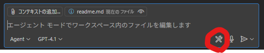

VSCode上部で「チャットで使用できるツールを選択してください」が開くので、リストの一番下の「その他のツールを追加」を押す。

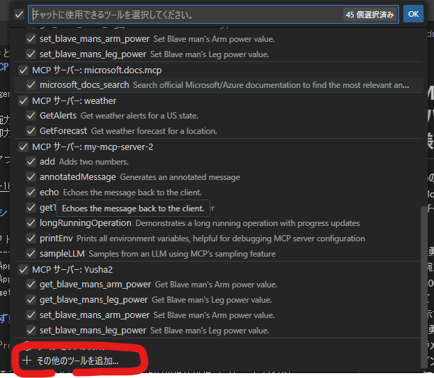

「MCPサーバーの追加」を押す。

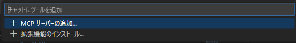

「stdio」を選択する。

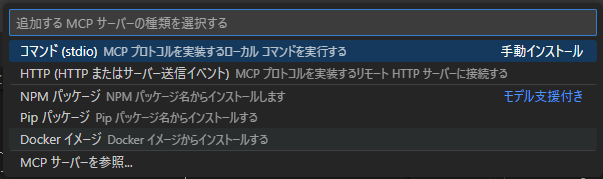

`C:\Program Files\McpJikken\ReviewWithOurCodingRulesMcpServer.exe`  
と入力する。（MCPサーバーの起動時のコマンドを登録）  
※必ず「"」で前後をくくること。

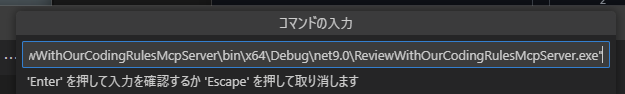

サーバーID（サーバーの名前）を入力する。（今回は下のようにした）

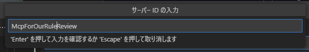

グローバルにする。（どちらでもいいが、一旦）

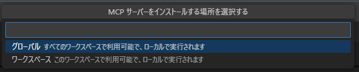

こういう感じで、`C:\Users\<ユーザー名>\AppData\Roaming\Code\User\mcp.json`に登録される。

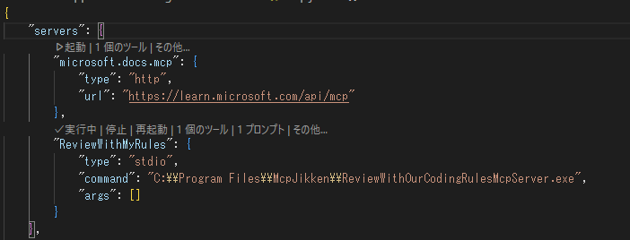

※今回のように、「Program Files」というスペースの入るようなコマンドにする場合は、最初と最後を「"」で囲まないと、下のように変になる。（「Program」で途切れて、のこりが「args」扱いになっちゃう）

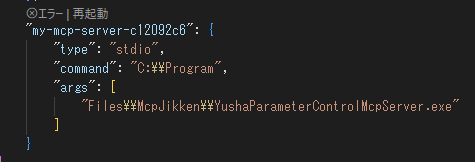

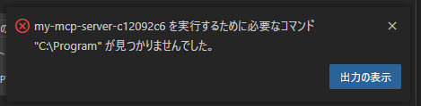

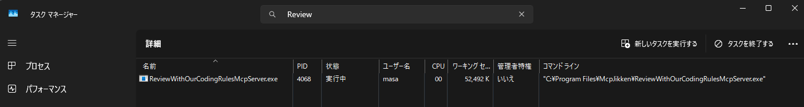

もし起動できてなかったら、設定ファイルを開くと、そのMCPサーバーの項目の上に「起動」ボタンが出てるので、それを押すと起動する。

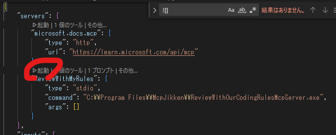

これで、MCPサーバーが使える状態になった。

この状態で、VSCodeのチャット欄を「Agent Mode」にして、「/」を入力する。

そうすると、下図のように、今回追加したプロンプトが表示されるのでそれを選択する。

そうすると、プロンプトの内容がチャット欄に出てくるので、そのままエンターを押すと、レビュー指示が飛び、Copilotが我々のコーディングルールでレビューをしてくれる。

動かし方は以上。

