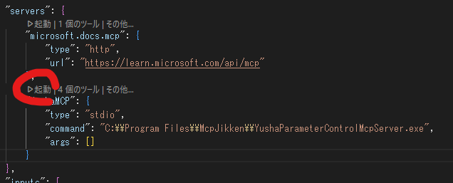

# アプリ/MCPサーバー仕様

VSCodeの、AgentModeのcopilotチャット欄から

- 「勇者の腕力を100にして！」と指示すると、「勇者のパラメータ」ウインドウの腕力のスライダーが100の位置になる
- 「勇者の脚力はいまいくつ？」と聞くと、「勇者のパラメータ」ウインドウの脚力のスライダーの値を答える

という実験アプリ＋MCPサーバー。

# ソリューション内のプロジェクト説明

| プロジェクト名                       | 概要                                                                                                                                                                        | exeの配置先                  |
| :----------------------------------- | :-------------------------------------------------------------------------------------------------------------------------------------------------------------------------- | ---------------------------- |
| McpJikkenAppWindow(.exe)             | 勇者の腕力と脚力を表示する。 スライダーで設定した腕力/脚力を、YushaParameterControlMcpServerのMCPサーバー経由で、VSCodeのcopilotチャット欄から設定できるようにする       | `C:\Program Files\McpJikken` |
| McpJikkenApp(.exe)                   | MCPサーバー👇と勇者ウインドウ👆の連携のためのプロセス。 パイプ通信で、やり取りを仲介する。                                                                             | 同上                         |
| YushaParameterControlMcpServer(.exe) | Copilotに「勇者の腕力を100にして！」「勇者の脚力はいまいくつ？」などと聞いたときに、 McpJikkenApp.exe経由でウインドウと通信して設定ができるようにするためのMCPサーバー。 | 同上                         |

# とりあえず動かす

* `1.CopyToProgramFiles.bat`をダブルクリックして実行する

3つのプロジェクトがビルドされ、成果物が所定の位置に配置（コピー）される。

* 配置されたMCPサーバーをVSCodeに登録する

「ツール」ボタンを押す。

VSCode上部で「チャットで使用できるツールを選択してください」が開くので、リストの一番下の「その他のツールを追加」を押す。

「MCPサーバーの追加」を押す。

「stdio」を選択する。

`C:\Program Files\McpJikken\YushaParameterControlMcpServer.exe`  
と入力する。（MCPサーバーの起動時のコマンドを登録）

サーバーID（サーバーの名前）を入力する。（今回はYushaMCPとした）

グローバルにする。（どちらでもいいが、一旦）

こういう感じで、`C:\Users\<ユーザー名>\AppData\Roaming\Code\User\mcp.json`に登録される。

※今回のように、「Program Files」というスペースの入るようなコマンドにする場合は、最初と最後を「"」で囲まないと、下のように変になる。（「Program」で途切れて、のこりが「args」扱いになっちゃう）

うまく登録出来たら、自動的に、MCPサーバーが起動する。

もし起動できてなかったら、設定ファイルを開くと、そのMCPサーバーの項目の上に「起動」ボタンが出てるので、それを押すと起動する。

これで、MCPサーバーが使える状態になった。

`2.StartWindow.bat`を実行し、勇者パラメータウインドウを開く。

VSCodeのcopilotチャット欄に、「勇者の腕力を90にして！」と入力すると、先ほど登録した「YushaMCP」のMCPサーバーに実装しているツールが実行され、ウインドウの腕力スライダーの値をとってきて、チャット欄に出してくれる。

ここに出ている「set_brave_mans_arm_power」というツール名は、YushaParameterControlMcpServerプロジェクトの「BraveMansTools.cs」に実装しているこのメソッド👇から来ている。

メソッドに付ける`McpServerTool`属性と、引数に付ける`Description`を見て、チャットクライアント（今回の場合VSCode）が、何をするためのツールかを判断して、しかるべきツールを呼んでくれる。（んだと思う）

上の確認で「続行」を押すと、連携が行われてスライダーが90になる。

とりあえず、動かし方は以上。

# 遊び方

数値を無茶苦茶大きくしたりすると、copilotが面白く返してくれるので楽しい。  

スライダーを90くらいにして、腕力の最大、100らしいんですけど今の腕力ってどうですかね？と聞くと、ほめてくれたりとか。

# 中の作り

